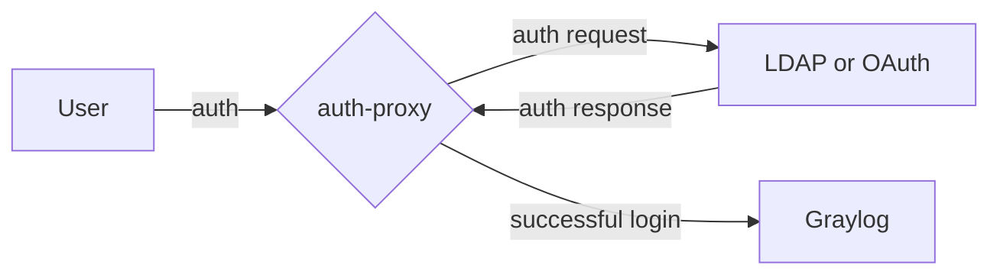
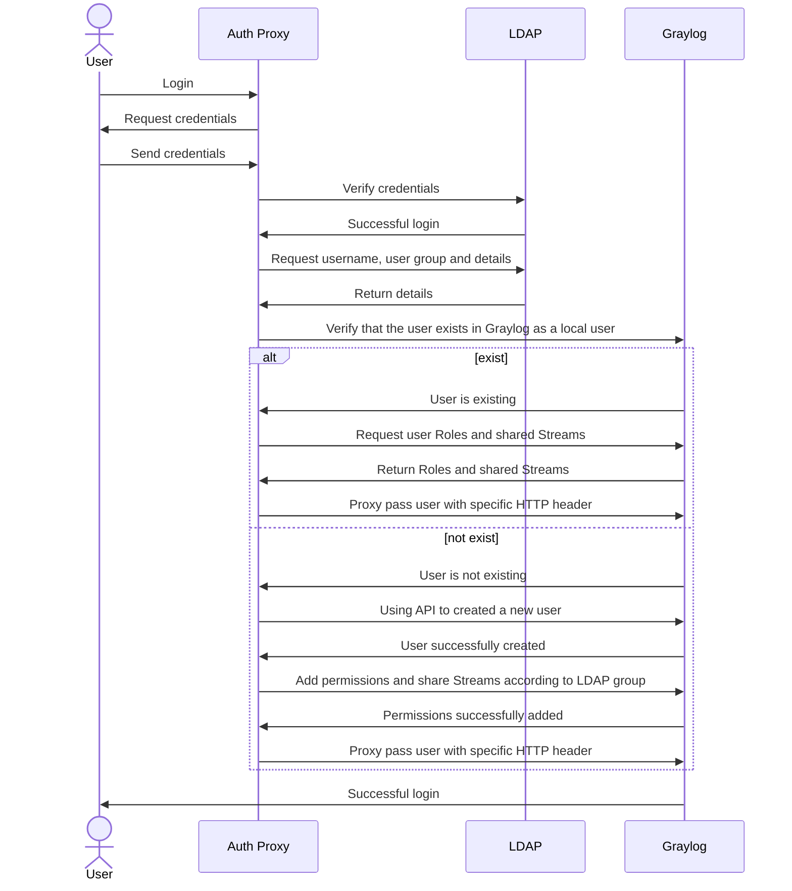
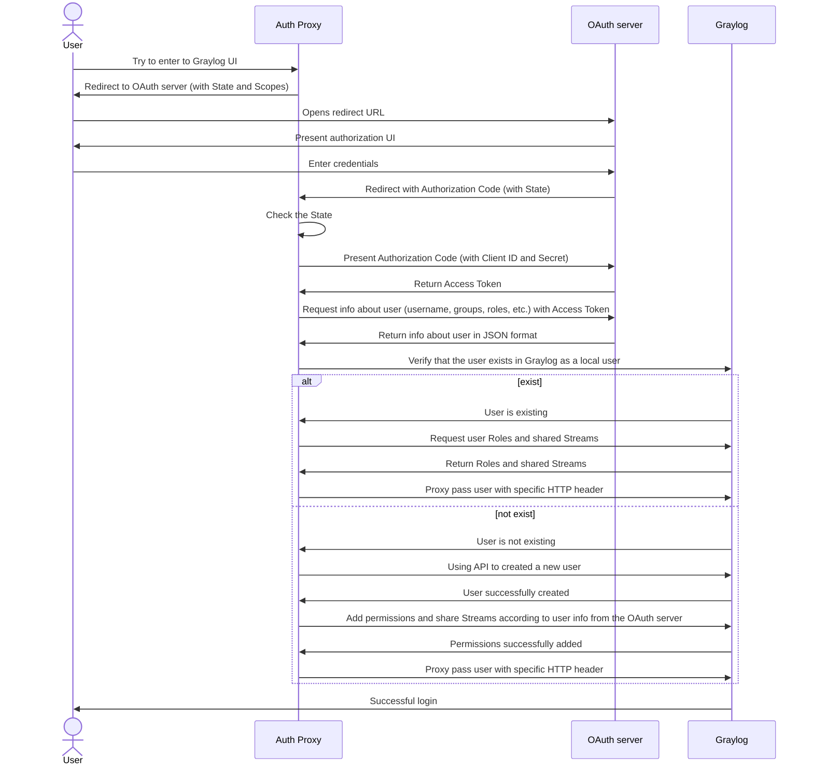

# qubership-graylog-auth-proxy

This is a proxy that allows you to authenticate users for the Graylog server using third-party databases
(for example, Active Directory) or OAuth authorization service (for example, Keycloak).



## Features

* Authentication and authorization based on: LDAP, LDAPS, LDAP with StartTLS protocols (OpenLDAP, Active Directory),
  OIDC + OAuth 2.0
* Proxy automatically creates user in Graylog with the same name as in the LDAP database or OAuth server
* Opportunity to create Graylog user with the certain roles according to group of the LDAP user or to role(-s)
  of the user from the OAuth server
* Opportunity to share Graylog streams to user according to their group in the LDAP database or to role(-s)
  of the user from the OAuth server
* Proxy creates users in the Graylog server with the random password to prevent authentication from bypassing the proxy.
  These passwords are rotated every `x` days (`3` by default) (available only for the LDAP mode at this moment)

## How it works

During working process qubership-graylog-auth-proxy connects to an SSO provider and handles all requests that are going to the
Graylog server. If user wants to access to the Graylog UI via the proxy, he/she needs to enter credentials for a user
from SSO provider. Then the proxy verifies these creds and adds user with the same username and random password
to Graylog and gives him the rights (attaches roles and shares several streams) based on the proxy configuration and
some attributes of the user from SSO provider. If the user is already exist in the Graylog, qubership-graylog-auth-proxy tries
to update it.

After successful authentication qubership-graylog-auth-proxy adds a trusted header with the username to each request that goes to
Graylog to avoid internal Graylog authentication. The proxy connect to LDAP only once and then uses cookies to identify
users for better performance. That mechanism work until cookies expired.

Regardless of this, the proxy runs the script for rotation of random passwords for users created in the Graylog and
deleting users that no longer exist in the SSO provider. This script runs every few days (3 days by default).

Also, qubership-graylog-auth-proxy have a metrics endpoint `/metrics` with Prometheus metrics.

LDAP mode:



OAuth mode:



## Parameters

Usage:

```bash
graylog_auth_proxy.py [OPTIONS]
```

Common options:

<!-- markdownlint-disable line-length -->
| Short flag | Flag                  | Description                                                                                                   | Default                                                                          |
|------------|-----------------------|---------------------------------------------------------------------------------------------------------------|----------------------------------------------------------------------------------|
|            | --config              | Config file path                                                                                              | ./config.yaml                                                                    |
|            | --auth-type           | Defines which type of authentication protocol will be chosen (LDAP or OAuth 2.0). Allowed values: ldap, oauth |                                                                                  |
|            | --log-level           | Logging level. Allowed values: DEBUG, INFO, WARNING, ERROR, CRITICAL                                          | INFO                                                                             |
|            | --host                | Host to bind                                                                                                  | localhost                                                                        |
| -p         | --port                | Port to bind                                                                                                  | 8888                                                                             |
|            | --metrics-port        | Port for Prometheus metrics                                                                                   | 8889                                                                             |
|            | --proxy-tls-enabled   | Run proxy in secure HTTPS mode                                                                                | false                                                                            |
|            | --proxy-tls-cert-file | Path to certificate file for proxy HTTP server                                                                |                                                                                  |
|            | --proxy-tls-key-file  | Path to private key file for proxy HTTP server                                                                |                                                                                  |
|            | --cookie              | HTTP cookie name to set in                                                                                    | authproxy                                                                        |
|            | --requests-timeout    | A global parameter describes how many seconds to wait for the server to send data before giving up            | 30                                                                               |
<!-- markdownlint-enable line-length -->

LDAP options:

<!-- markdownlint-disable line-length -->
| Short flag | Flag                     | Description                                                                                                   | Default                                                                          |
|------------|--------------------------|---------------------------------------------------------------------------------------------------------------|----------------------------------------------------------------------------------|
|            | --ldap-url               | LDAP URI to query                                                                                             | ldap://localhost:389                                                             |
|            | --http-realm             | HTTP auth realm                                                                                               | Restricted                                                                       |
| -s         | --ldap-starttls          | Establish a STARTTLS protected session                                                                        | false                                                                            |
|            | --ldap-over-ssl          | Establish LDAP session over SSL                                                                               | false                                                                            |
|            | --disable-referrals      | Sets ldap.OPT_REFERRALS to zero                                                                               | false                                                                            |
| -b         | --base-dn                | LDAP base DN                                                                                                  |                                                                                  |
| -D         | --bind-dn                | LDAP bind DN                                                                                                  |                                                                                  |
| -w         | --bind-password          | LDAP password for the bind DN                                                                                 |                                                                                  |
|            | --htpasswd               | Path to htpasswd file with LDAP password for the bind DN in Base64 format                                     |                                                                                  |
| -f         | --filter                 | LDAP filter                                                                                                   | (cn=%(username)s)                                                                |
<!-- markdownlint-enable line-length -->

Graylog options:

<!-- markdownlint-disable line-length -->
| Short flag | Flag                               | Description                                                                                | Default                                                                          |
|------------|------------------------------------|--------------------------------------------------------------------------------------------|----------------------------------------------------------------------------------|
|            | --role-mapping                     | Filter for mapping Graylog roles between LDAP and Graylog users by memberOf field          |                                                                                  |
|            | --stream-mapping                   | Filter for sharing Graylog streams between LDAP and Graylog users by memberOf field        |                                                                                  |
|            | --pre-created-users                | Comma separated pre-created users in Graylog for which you do not need to rotate passwords | admin,auditViewer,operator,telegraf_operator,graylog-sidecar,graylog_api_th_user |
|            | --graylog-host                     | Graylog host                                                                               | http://127.0.0.1:9000                                                            |
|            | --graylog-tls-insecure-skip-verify | Allows skipping verification of certificate from Graylog server                            | false                                                                            |
|            | --graylog-tls-ca-file              | Path to CA certificate file for connection to Graylog                                      |                                                                                  |
|            | --graylog-tls-cert-file            | Path to client certificate file for connection to Graylog                                  |                                                                                  |
|            | --graylog-tls-key-file             | Path to private key file for connection to Graylog                                         |                                                                                  |
|            | --graylog-admin-user               | Existed Graylog with admin rights                                                          | graylog_api_th_user                                                              |
|            | --rotation-pass-interval           | Interval in days between password rotation for non-pre-created users                       | 3                                                                                |
<!-- markdownlint-enable line-length -->

OAuth options:

<!-- markdownlint-disable line-length -->
| Short flag | Flag                       | Description                                                                                                                                                                                                                             | Default                    |
|------------|----------------------------|-----------------------------------------------------------------------------------------------------------------------------------------------------------------------------------------------------------------------------------------|----------------------------|
|            | --oauth-host               | OAuth2 authorization server host field                                                                                                                                                                                                  | http://127.0.0.1:8080      |
|            | --oauth-authorization-path | This path will be used to build URL for redirection to OAuth2 authorization server login page                                                                                                                                           |                            |
|            | --oauth-token-path         | This path will be used to build URL for getting auth token from OAuth2 authorization server                                                                                                                                             |                            |
|            | --oauth-userinfo-path      | This path will be used to build URL for getting information about current user from OAuth2 authorization server to get username and entities (roles, groups, etc.) for Graylog roles and streams mapping                                |                            |
|            | --oauth-redirect-uri       | URI to redirect after successful logging in on OAuth2 authorization server side                                                                                                                                                         | http://localhost:8888/code |
|            | --oauth-client-id          | OAuth2 Client ID for the proxy                                                                                                                                                                                                          |                            |
|            | --oauth-client-secret      | OAuth2 Client Secret for the proxy                                                                                                                                                                                                      |                            |
|            | --oauth-htpasswd           | Path to htpasswd file with Client Secret for the OAuth2 protocol in Base64 format                                                                                                                                                       |                            |
|            | --oauth-scopes             | OAuth2 scopes for the proxy separated by spaces. Configured for Keycloak server by default                                                                                                                                              | openid profile roles       |
|            | --oauth-user-jsonpath      | JSONPath (by jsonpath-ng) for taking username from the JSON returned from OAuth2 server by using userinfo path. Configured for Keycloak server by default                                                                               | preferred_username         |
|            | --oauth-roles-jsonpath     | JSONPath (by jsonpath-ng) for taking information about entities (roles, groups, etc.) for Graylog roles and streams mapping from the JSON returned from OAuth2 server by using userinfo path. Configured for Keycloak server by default | realm_access.roles[*]      |
<!-- markdownlint-enable line-length -->

Auth provider TLS options (TLS configuration for both LDAP and OAuth):

<!-- markdownlint-disable line-length -->
| Short flag | Flag                            | Description                                                                                 | Default |
|------------|---------------------------------|---------------------------------------------------------------------------------------------|---------|
|            | --auth-tls-insecure-skip-verify | Allows skipping verification of certificate from LDAP server or OAuth authentication server | false   |
|            | --auth-tls-ca-file              | Path to CA certificate file for LDAP server or OAuth authentication server                  |         |
|            | --auth-tls-cert-file            | Path to client certificate file for LDAP server or OAuth authentication server              |         |
|            | --auth-tls-key-file             | Path to private key file for LDAP server or OAuth authentication server                     |         |
<!-- markdownlint-enable line-length -->

You can set each parameter that has a non-short flag at the config file (except `--config` parameter).
